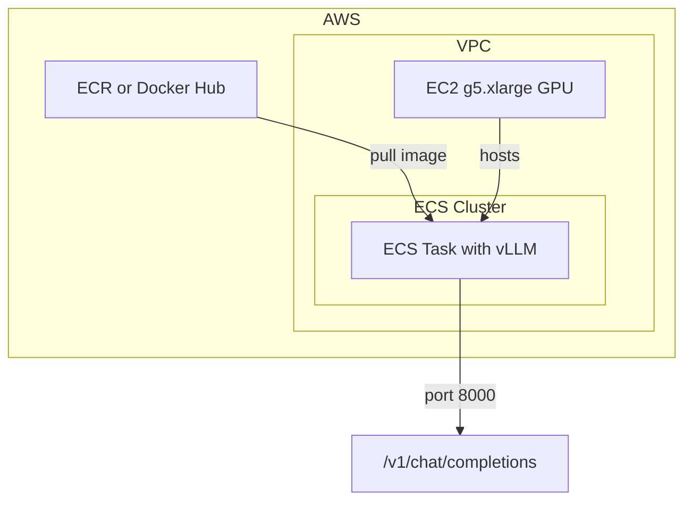

# Simple AWS ECS Docker for Qwen2.5-7B-Instruct Inference

## Approach

Use the official vLLM OpenAI-compatible image (no custom Dockerfile needed) with an ECS task definition. Deploy manually via AWS CLI for maximum simplicity. ECS Fargate does not support GPUs, so you must use **ECS with EC2** launch type on a GPU instance (e.g., g5.xlarge).

## Architecture



## Files to Create

### 1. [ecs/task-definition.json](ecs/task-definition.json)

Minimal ECS task definition with:

- **Image**: `vllm/vllm-openai:cu130-nightly` (or `vllm/vllm-openai` for stable)
- **GPU**: `resourceRequirements: [{ type: "GPU", value: "1" }]`
- **Memory/CPU**: ~15GB memory, 4096 CPU (g5.xlarge limits)
- **Port**: 8000
- **Command**: `--model Qwen/Qwen2.5-7B-Instruct`
- **Logging**: `awslogs` to CloudWatch

### 2. [ecs/run-task.sh](ecs/run-task.sh) (optional helper)

Simple script to:

- Register the task definition (if changed)
- Run a one-off task or create a service
- Output the public IP or NLB endpoint for testing

### 3. Update [README.md](README.md)

Add an "ECS Deployment" section with:

- Prerequisites (ECS cluster, GPU capacity provider or EC2 instance)
- Steps: create cluster → register task definition → run task or create service
- Test command: `curl http://<endpoint>:8000/v1/chat/completions ...`

## Prerequisites (Manual Setup)

You will need to create once (via Console or CLI):

| Resource         | Purpose                                                       |
| ---------------- | ------------------------------------------------------------- |
| ECS Cluster      | Container orchestration                                       |
| VPC + Subnets    | Network (default VPC is fine)                                 |
| Security Group   | Inbound 8000 from your IP or VPC                              |
| EC2 GPU instance | g5.xlarge (or g6.xlarge) with ECS-optimized GPU AMI            |
| IAM roles        | `ecsTaskExecutionRole`, `AmazonEC2ContainerServiceforEC2Role` |

**GPU AMI**: Get the latest ECS GPU AMI:

```bash
aws ssm get-parameters --names /aws/service/ecs/optimized-ami/amazon-linux-2/gpu/recommended --region us-east-1
```

**User data** on EC2 must include: `echo ECS_ENABLE_GPU_SUPPORT=true >> /etc/ecs/ecs.config`

## Simplest Path (No CDK/Terraform)

1. Create ECS cluster and register one g5.xlarge EC2 instance with GPU support.
2. Register task definition: `aws ecs register-task-definition --cli-input-json file://ecs/task-definition.json`
3. Run task: `aws ecs run-task --cluster <cluster> --task-definition vllm-qwen --launch-type EC2`
4. Get task IP from ECS console or `aws ecs describe-tasks`, then `curl http://<IP>:8000/v1/chat/completions ...`

## Optional: Hugging Face Token

If the model is gated, add to task definition:

```json
"environment": [{ "name": "HUGGING_FACE_HUB_TOKEN", "value": "<token>" }]
```

(Prefer Secrets Manager for production.)

## Summary

| Deliverable                | Description                                           |
| -------------------------- | ----------------------------------------------------- |
| `ecs/task-definition.json` | ECS task definition for vLLM + Qwen2.5-7B             |
| `ecs/run-task.sh`          | Optional CLI helper script                            |
| README update              | ECS deployment section with step-by-step instructions |

No custom Dockerfile needed—the official vLLM image serves the model when given `--model Qwen/Qwen2.5-7B-Instruct` in the command.
